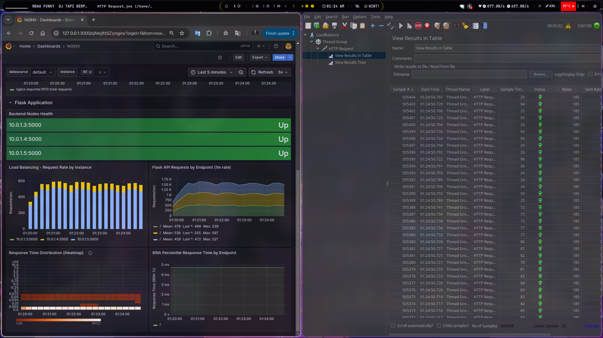
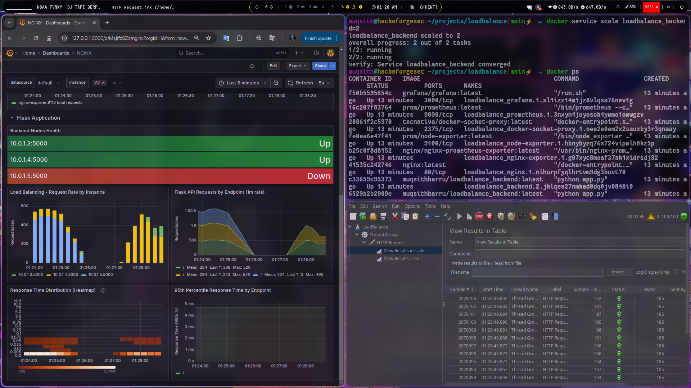
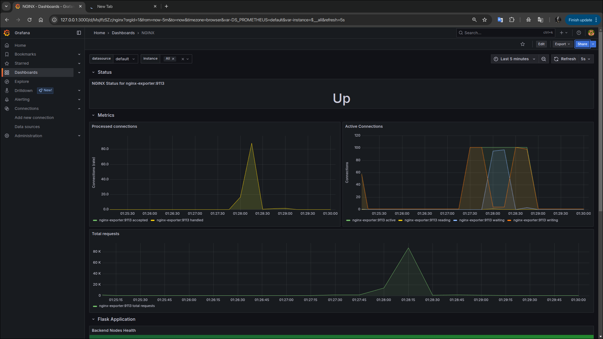
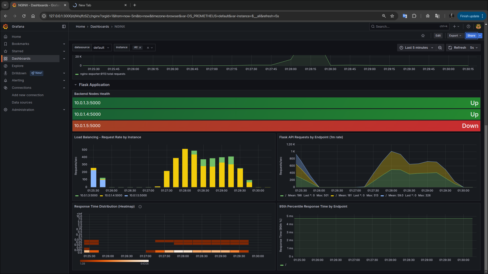

# 🚀 Load Balancing & Monitoring System

Repositori ini untuk melengkapi tugas projek akhir kami, berikut adalah konfigurasi untuk sistem load balancing dan monitoring yang scalable menggunakan Docker Swarm, Nginx,Prometheus, dan Grafana

## 📋 Tech Stack

| Komponen | Teknologi | Deskripsi |
|----------|-----------|-----------|
| **Backend** | Custom Docker Image | Aplikasi backend |
| **Load Balancer** | Nginx | Mendistribusikan traffic ke multiple instance backend |
| **Monitoring** | Prometheus | Pengumpulan dan penyimpanan metrik |
| **Visualisasi** | Grafana | Dashboard untuk memvisualisasikan metrik sistem |
| **Exporters** | Nginx Exporter, Node Exporter | Mengekspor metrik dari Nginx dan sistem host |

## 🏗️ Arsitektur

Sistem ini dirancang dengan arsitektur microservice menggunakan Docker Swarm untuk orchestration:

- **Frontend**: Diakses pengguna melalui port 8080, dilayani oleh Nginx
- **Backend**: Multiple instance untuk redundansi dan performance
- **Monitoring Stack**: Prometheus mengumpulkan metrik dari semua service, Grafana menampilkan visualisasi

## 📝 Prasyarat

- Docker Engine v19.03.0+
- Docker Compose v1.27.0+
- Docker Swarm diinisialisasi pada host

## 🛠️ Cara Menggunakan

### 1. Persiapan

Clone repositori ini:

```bash
git clone https://github.com/indonumberone/load_balancer
cd load_balancer
```

### 2. Deployment

Deploy stack menggunakan Docker Swarm:

```bash
docker swarm init
docker stack deploy -c docker-compose.yml loadbalance
```

### 3. Verifikasi Deployment

Cek status services:

```bash
docker service ls
```

## 📊 Akses Services

| Service | URL | Deskripsi |
|---------|-----|-----------|
| Backend API | http://127.0.0.1:8080 | API endpoint melalui Nginx load balancer |
| Prometheus | http://127.0.0.1:9090 | Interface monitoring metrics |
| Grafana | http://127.0.0.1:3000 | Dashboard visualisasi (default: admin/admin) |
| Node Exporter | http://127.0.0.1:9100 | Metrics host system |
| Nginx Exporter | http://127.0.0.1:9113 | Metrics Nginx |

## 🔍 Monitoring

### Prometheus

Prometheus dikonfigurasi untuk mengumpulkan metrik dari:

- Backend services (melalui endpoint /metrics)
- Nginx (via nginx-exporter)
- Node metrics (via node-exporter)
- Docker metrics (via docker-socket-proxy)

### Grafana

Grafana telah dikonfigurasi dengan datasource Prometheus dan beberapa dashboard dasar:

1. Login ke Grafana di http://127.0.0.1:3000 (username: admin, password: admin)
2. Lihat dashboard yang tersedia di menu

## ⚙️ Konfigurasi

### Scaling Services

Untuk scaling backend service:

```bash
docker service scale loadbalance_backend=5
```

### Pembaruan Konfigurasi

Untuk memperbarui konfigurasi:

1. Edit file konfigurasi yang relevan
2. Deploy ulang stack:

```bash
docker stack deploy -c docker-compose.yml loadbalance
```

## Docker Swarm: scalling di Beberapa Node

Docker Swarm memungkinkan membuat dan mengelola klaster host Docker, sehingga dapat scalling aplikasi di beberapa mesin.

### Inisialisasi Swarm

Untuk membuat swarm baru, jalankan perintah berikut pada node yang akan menjadi manager:

```bash
docker swarm init
```

### Tambahkan rules firewall di master dan worker

```sh
sudo ufw allow 2377
```

```sh
sudo ufw allow 22/tcp
sudo ufw allow 2377/tcp
sudo ufw allow 7946/tcp
sudo ufw allow 7946/udp
sudo ufw allow 4789/udp
```

```bash
sudo ufw reload
```

### Menambahkan Node ke Swarm

Untuk menambahkan node worker ke swarm, jalankan perintah berikut pada node manager untuk mendapatkan token join:

```bash
docker swarm join-token worker
```

Kemudian, jalankan perintah yang ditampilkan pada node worker untuk bergabung dengan swarm.

### scalling Layanan di Beberapa Node

Setelah node ditambahkan ke swarm, Anda dapat menskalakan layanan Anda di beberapa node:

```bash
docker service scale loadbalance_backend=5
```

## 🔧 Troubleshooting

### Melihat Logs

```bash
# Logs untuk service tertentu
docker service logs loadbalance_backend
docker service logs loadbalance_nginx
```

### Health Check

```bash
# Cek health backend
curl http://127.0.0.1:8080/health

# Cek status Prometheus targets
curl http://127.0.0.1:9090/api/v1/targets
```

## Testing dengan JMeter

### Load Balancing Test



### Availability Test



### Monitoring Test




